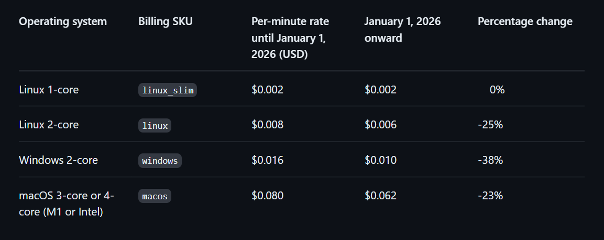

# GitHub Actions Pricing Change – 2026
*** What is a GitHub Runner?**

A GitHub runner is the compute (VM/instance) where GitHub executes your CI/CD jobs such as build, test, lint, security scans. 

Whenever a commit or pull request happens, GitHub spins up a runner to execute the workflow 

**There are two types of runners:**

**GitHub-hosted runners:**

* Fully managed by GitHub

* No infrastructure management needed

* GitHub charges for usage

**Self-hosted runners:**

* You bring your own VM (AWS / Azure / on-prem)

* You install the GitHub runner agent

* Previously free from GitHub’s side (you only paid cloud cost)

## what are the new pricing changes in 2026? 
There are two major pricing changes:

1. Change #1: 40% Discount on GitHub-Hosted Runners
* Applies to Linux, Windows, all hosted runners, Effective from 1 Jan 2026

2. Change #2: New Platform Fee
GitHub is introducing a platform fee of $0.002 per minute of execution. This platform fee applies to both github-hosted and self-hosted runners 

## key comparisons: 

**For github hosted runners:**

 

**Self-Hosted Runners: Previously Free → Now Metered**

* Before 2026:

    * GitHub cost = $0

    * You paid only AWS/Azure VM cost

* From 31 Mar 2026:

    * GitHub platform fee = $0.002/min

    * PLUS your cloud VM cost

⚠️ This is the only scenario where cost increases.

## who is actually impacted? 

| User Type                  | Impacted?   |
| -------------------------- | ----------- |
| GitHub Enterprise          | ❌ No impact |
| Public repos / Open Source | ❌ No impact |
| Free / Pro / Team plans    | ✅ Impacted  |
| Private repositories       | ✅ Impacted  |

Most companies without Enterprise plans using private repos fall into the impacted category.

## Why GitHub Did This

* Self-hosted runners were using GitHub Actions control plane for free

* GitHub-hosted runners were subsidizing the entire ecosystem

* Platform fee helps GitHub sustain and improve Actions infrastructure 

## What This Means for us? 
Since we are going to use, github-hosted runners and private repositories, the new pricing changes are in advantage for us, eventually reduces cost.(refer comparison table). And we have to focus more on CI/CD Optimization. 

### note: 
In GitHub Actions, execution time refers to amount of time a workflow, or a specific job within a workflow, spends actively running on a virtual machine (runner). It includes the time taken for all steps within that job, from setup to completion (or failure/cancellation). 

* Workflow Run Time: The total time from when a workflow starts until all jobs are completed or cancelled. This time can be longer than the sum of individual job execution times if jobs run in parallel.
* Job Execution Time: The time spent running a specific set of steps on a single runner. This is the primary unit for billing calculations.

**How is it Calculated?**
GitHub calculates execution time based on the total processing time used by the runners. For billing purposes, the calculation involves rounding job minutes and applying multipliers for different operating systems. 
1. Job-Level Time Measurement
The time for a single job is measured from its start time to its completion time. Within the GitHub UI, you can view the execution time for each job in the workflow run summary. 

2. Billing Calculation
For private repositories using GitHub-hosted runners, the time is calculated as billable minutes using the following rules: 
* Rounding: Each job's execution time is rounded up to the nearest whole minute (e.g., a job running for 2 minutes and 10 seconds is billed for 3 minutes).
* Parallel Jobs: If you have multiple jobs running in parallel, their times are added up individually. The total billable time is the sum of all rounded job minutes across the workflow run.
* Minute Multipliers: A multiplier is applied based on the runner's operating system:
    * Linux: Multiplier of 1
    * Windows: Multiplier of 2
    * macOS: Multiplier of 10 

**Example:**
A workflow has three jobs:
Job 1 (Linux): 11m 13s actual time -> 12 billable minutes (12 x 1 = 12 minutes)
Job 2 (Windows): 6m 36s actual time -> 7 billable minutes (7 x 2 = 14 minutes)
Job 3 (macOS): 17m 50s actual time -> 18 billable minutes (18 x 10 = 180 minutes)  